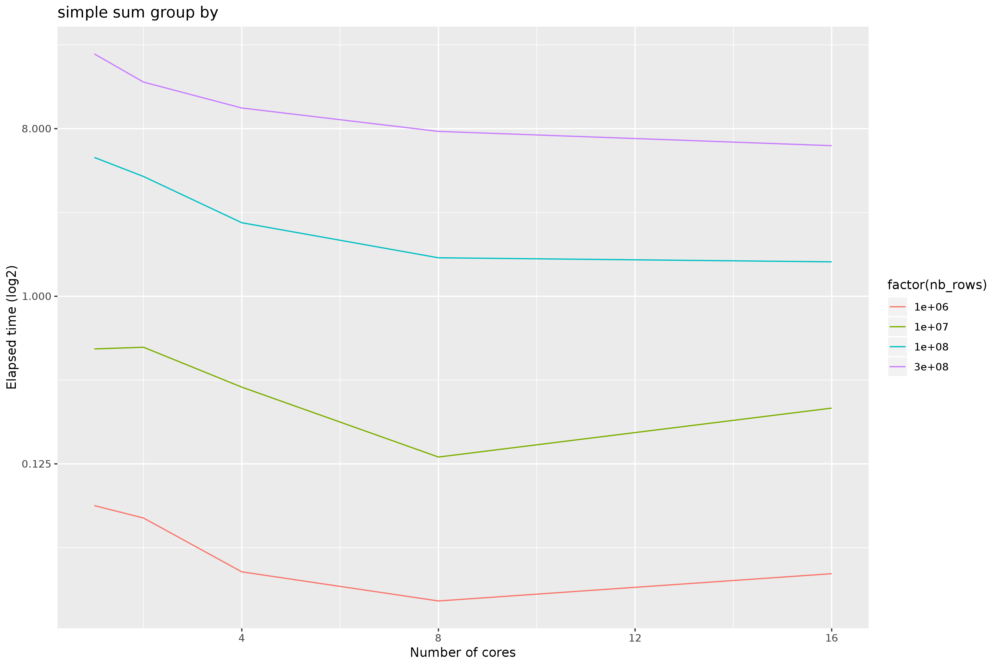
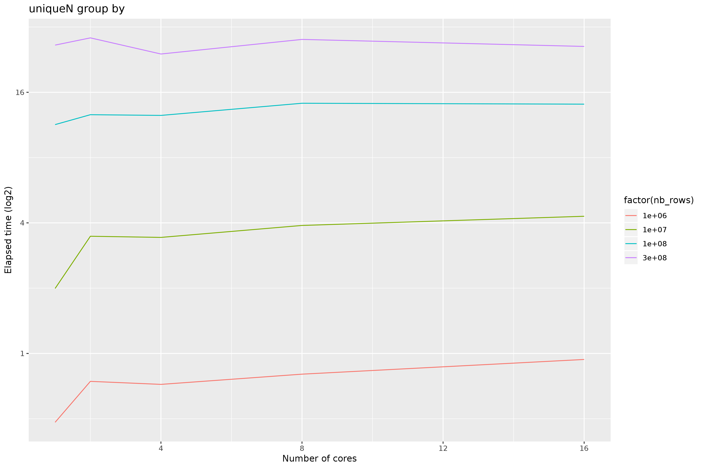

# repex_slow_uniqueN
Parallelization when grouping and computing uniqueN is having a surprising behavior

When I use parallelization for sum task, it works as expected : 

But when I use uniqueN, the parallelization makes it worse.

